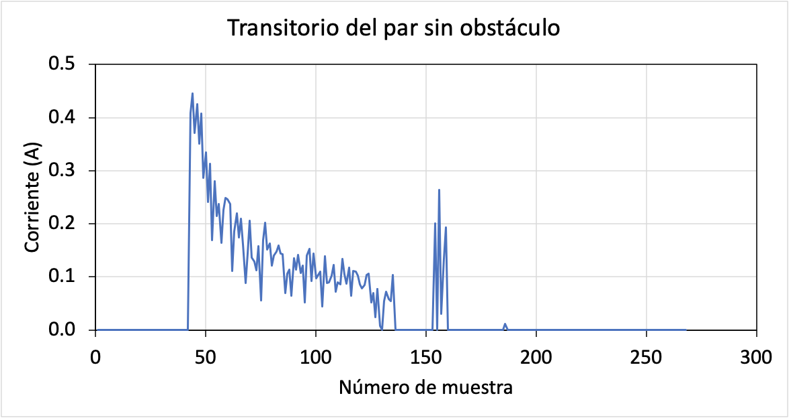
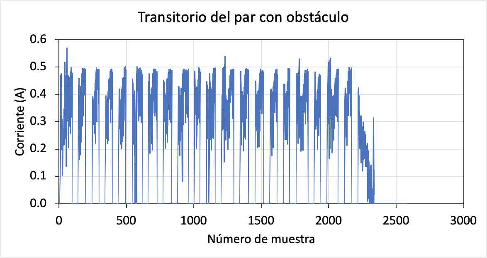
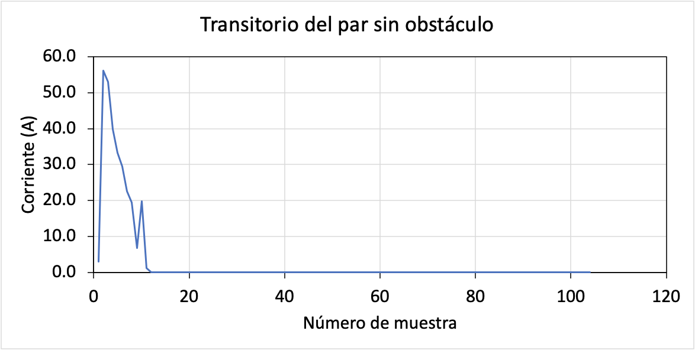
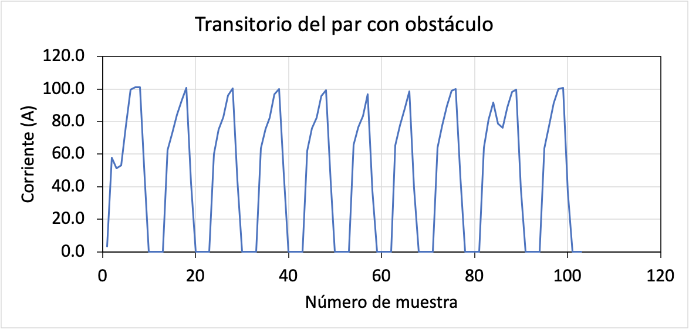

# Control remoto de un servomotor con control de par

Este es un proyecto basado en dos módulos ESP32. El primero, de ahora en adelante ***master***, monitorizará su orientación mediante una [<abbr title="Inertial Measurement Unit">IMU</abbr>](https://es.wikipedia.org/wiki/Unidad_de_medici%C3%B3n_inercial) y la enviará inalámbricamente a un segundo módulo ESP32, de ahora en adelante ***slave***. El *slave* recibirá la orientación del *master* y, en función de esta, orientará un servomotor que emula uno de los motores del EndoWrist. A su vez, el *slave* devolverá al *master* el par de motor medido emulando el contacto con tejidos. Ese par de motor lo enviaremos por conexión serie a RoboDK junto a los ángulos Euler que ya estábamos enviando en la sesión anterior.

## Objetivos

- Monitorizar la orientación de un módulo ESP32 llamado *master*.
- Enviar la orientación de manera inalámbrica a un segundo módulo ESP32 llamado *slave*.
- Orientar un servomotor en *slave* según la orientación del *master*.
- Delvolver al *master* una medición del par aplicado por el servomotor.
- Enviar el par,  junto con la orientación, a RoboDK mediante conexión serie.

## Procedimiento

> El el presente documento se muestra el código necesario para realizar la comunicación inalámbrica entre dos módulos ESP32. El código **debe de añadirse** al código ya existente de la sesión anterior (medición de ángulos Euler, envío por terminal serie, etc.). El código de la sesión anterior se ha obviado de los ejemplos para hacerlos más claros.

### Comunicación inalámbrica

#### Obtener las direcciones MAC

Para realizar las transmisiones, tanto el *master* como el *slave* necesitan saber la dirección MAC del otro. Esta dirección MAC les identifica en una red de manera inequívoca. Para obtener la dirección MAC, utilizaremos el siguiente código:

```c++
// Incluimos la libreria para una conexion WiFi
#include "WiFi.h"
 
void setup(){
  // Configuramos la comunicacion serie
  Serial.begin(115200);
  // Habilitamos el WiFi en modo estacion
  WiFi.mode(WIFI_MODE_STA);
  // Mostramos por terminal la direccion MAC del dispositivo
  Serial.println(WiFi.macAddress());
}
 
void loop(){
  // Aqui no hacemos nada de momento
}
```

De este modo, abrimos un terminal en Arduino IDE y podremos obtener la dirección MAC. Esto hay que ejecutarlo en ambos módulos. **¡Apuntaros el identificador!** Será imprescindible.

### *Sketch* del *master*

En el *master*, ejecutamos el siguiente código:

```c++
// Incluimos las librerias para el protocolo ESP_NOW y 
// una conexion WiFi
#include <esp_now.h>
#include <WiFi.h>

// Direccion MAC del slave (reemplazar con el que habeis obtenido)
uint8_t slaveMacAddress[] = {0xAC, 0x67, 0xB2, 0x05, 0x64, 0xC0};

// Esta es la estructura de los datos que enviaremos
// De momento solo enviaremos un numero
typedef struct {
    float exampleNumber;
} TxMessage;
// Creamos una varaible con la estructura recien creada
TxMessage dataToSlave;

// Esta es la estructura de los datos que reciviremos
typedef struct {
    float torque;
} RxMessage;
// Creamos una varaible con la estructura recien creada
RxMessage dataFromSlave;

// Funcion que se ejecutara cada vez que se haya recibido un mensaje
void OnDataRecv(const uint8_t * mac, const uint8_t *incomingData, int len) {
  // Copiamos los datos recibidos a nuestra variable dataFromSlave
  memcpy(&dataFromSlave, incomingData, sizeof(dataFromSlave));
  Serial.print("Torque received:\t");
  Serial.println(dataFromSlave.torque, DEC);
}
 
void setup() {
  // Configuramos la comunicacion serie
  Serial.begin(115200);

  // Habilitamos el WiFi en modo estacion
  WiFi.mode(WIFI_STA);

  // Inicializamos ESP-NOW
  if (esp_now_init() != ESP_OK) {
    Serial.println("Error initializing ESP-NOW");
    return;
  }
  
  // Registramos el slave
  esp_now_peer_info_t peerInfo = {};
  memcpy(peerInfo.peer_addr, slaveMacAddress, 6);
  peerInfo.channel = 0;  
  peerInfo.encrypt = false;
  
  // Anadimos el slave     
  if (esp_now_add_peer(&peerInfo) != ESP_OK){
    Serial.println("Failed to add peer");
    return;
  }
  // Configuramos la funcion a utilizar cada vez que se reciva
  // un mensaje
  esp_now_register_recv_cb(OnDataRecv);
}
 
void loop() {

  // Como ejemplo, enviaremos un numero que iremos incrementando
  esp_err_t result = esp_now_send(slaveMacAddress, (uint8_t *) &dataToSlave, sizeof(dataToSlave));
   
  if (result == ESP_OK) {
    Serial.println("Sent with success");
  }
  else {
    Serial.println("Error sending the data");
  }
  
  // Dejaremos 1 segundo entre envios y incrementamos el numero
  // a enviar
  dataToSlave.exampleNumber = dataToSlave.exampleNumber + 1;
  delay(1000);
}
```

#### *Sketch* del *slave*

Ahora toca cargar el código al *slave*. **Recordad poner la dirección MAC del *master* en este caso.** Omito comentarios de código que ya estuvieran en el ejemplo anterior:

```c++
#include <esp_now.h>
#include <WiFi.h>

// Direccion MAC del master (reemplazar con el que habeis obtenido)
uint8_t masterMacAddress[] = {0x7C, 0x9E, 0xBD, 0x61, 0xA3, 0x88};

// Esta es la estructura de los datos que enviaremos
typedef struct {
    float torque;
} TxMessage;
// Creamos una varaible con la estructura recien creada
TxMessage dataToMaster;

// Esta es la estructura de los datos que reciviremos
typedef struct {
    float exampleNumber;
} RxMessage;
// Creamos una varaible con la estructura recien creada
RxMessage dataFromMaster;

void OnDataRecv(const uint8_t * mac, const uint8_t *incomingData, int len) {
  // Copiamos los datos recibidos a nuestra variable dataFromMaster
  memcpy(&dataFromMaster, incomingData, sizeof(dataFromMaster));
  Serial.print("Example number received:\t");
  Serial.println(dataFromMaster.exampleNumber, DEC);
}
 
void setup() {
  Serial.begin(115200);
  WiFi.mode(WIFI_STA);

  if (esp_now_init() != ESP_OK) {
    Serial.println("Error initializing ESP-NOW");
    return;
  }
  
  // Registramos el master
  esp_now_peer_info_t peerInfo = {};
  memcpy(peerInfo.peer_addr, masterMacAddress, 6);
  peerInfo.channel = 0;  
  peerInfo.encrypt = false;
  
  // Anadimos el master     
  if (esp_now_add_peer(&peerInfo) != ESP_OK){
    Serial.println("Failed to add peer");
    return;
  }

  esp_now_register_recv_cb(OnDataRecv);
}
 
void loop() {

  // Como ejemplo, enviaremos un numero que iremos incrementando
  // emulando el torque
  esp_err_t result = esp_now_send(masterMacAddress, (uint8_t *) &dataToMaster, sizeof(dataToMaster));
   
  if (result == ESP_OK) {
    Serial.println("Sent with success");
  }
  else {
    Serial.println("Error sending the data");
  }
  
  // Incrementamos el numero a enviar
  dataToMaster.torque = dataToMaster.torque + 1;
  delay(1000);
}
```

#### *Challenge* #1

Bien. Si hemos seguido las instrucciones al pie de la letra, ahora mismo tenemos dos ESP32 comunicándose de manera inalámbrica. Ahora el reto (y eso quiere decir, que tenéis que hacerlo vosotros) es editar el código del *master* para incorporar este código que teníais de la sesión anterior. Es decir, hacer que el *master* lea los ángulos de Euler de la IMU y los envíe al *slave*. ¿Qué deberéis hacer para ello?

- Incorporar la parte del código de la IMU (importar librería, inicializar la IMU, obtener los datos y guardarlos en una variable, etc.).
- Incorporar el código de comunicación.
- Adaptar el código de comunicación (modificar las estructuras `RxMessage` y `TxMessage` (tanto del *master* como del *slave*) para incorporar RPW)
- ¡Comprueba que todo funcione antes de seguir adelante!

> Si te clavas en el reto o te salen errores, peléate un poco pero pregunta de inmediato a los profesores. El reto, por su dificultad, está pensado para hacerse en 10~15 min. Si tardas más no te dará tiempo a hacer la práctica en clase. 😅

### Control de un servomotor

#### Conexionado del servomotor

Vamos a controlar el [servomotor KY66](http://www.ee.ic.ac.uk/pcheung/teaching/DE1_EE/stores/sg90_datasheet.pdf) con el *slave*. Para ello, conectamos nuestro ESP32 en una *protoboard* y conectamos los pines <kbd>VIN</kbd>, <kbd>D33</kbd> y <kbd>GND</kbd> con los cables de color `rojo`, `naranja`,  y `marrón`, respectivamente.

#### Posicionamiento del motor

Para controlar el motor utilizaremos la librería [Servo Library for ESP32 de John K. Bennett](https://github.com/madhephaestus/ESP32Servo). Esta librería genera una salida [<abbr title="Pulse-Width Modulation">PWM</abbr>](https://es.wikipedia.org/wiki/Modulaci%C3%B3n_por_ancho_de_pulsos) para fijar la posición del motor. El motor se puede posicionar de -90º a 90º. O lo que es lo mismo, podemos girarlo 180º. 

Para instalar la librería, en Arduino IDE, nos vamos a `Sketch > Include Library > Manage Libraries`, escribimos `ESP32Servo` en el campo de búsqueda e instalamos la librería indicada. Ya la hemos instalado 😉

Vamos a ver el código para posicionar el servo:

```c++
// Incluimos la libreria del servo
#include <ESP32Servo.h>

// Declaramos una variable para el servo
Servo servoMotor;

void setup() {
  // Configuramos la comunicacion serie
  Serial.begin(115200);

  // Nos agenciamos unos timers internos para poder operar
  // (¿Que que es un timer? -> https://bit.ly/2Y9BAwg)
  ESP32PWM::allocateTimer(0);
  ESP32PWM::allocateTimer(1);
  ESP32PWM::allocateTimer(2);
  ESP32PWM::allocateTimer(3);
  servoMotor.setPeriodHertz(50);
  
  // Iniciamos el servo indicandole que utilizaremos el pin 33
  servoMotor.attach(33);
}

void loop() {
  
  // Vamos a hacer un bucle en el que el motor vaya de -90 a 0 a +90
  // en intervalos de 1 segundo (acordaros que esto es lo mismo que
  // hacer 0, 90, 180)
  Serial.println("Servo position: -90º");
  servoMotor.write(0);
  delay(1000);

  Serial.println("Servo position: 0º");
  servoMotor.write(90);
  delay(1000);

  Serial.println("Servo position: 90º");
  servoMotor.write(180);
  delay(1000);
}
```

En este instante debemos de tener nuestro servo operando sin problemas 🥳

#### *Challenge* #2

Añade el código de posicionamiento del servo al código del primer apartado de tal modo que el servo se posicione según **el *pitch*** que enviemos desde el *master*.

### Lectura del torque

Ahora nos falta leer el [torque o par](https://es.wikipedia.org/wiki/Par_motor) que está haciendo el motor. Lo mediremos midiendo ("*¡Gracias, Capitan Obvious!*") la potencia eléctrica que consume el motor. Acordemonos de cuál era la expresión de la potencia: P = I·V

En nuestro caso, la tensión será siempre la misma, así que lo que haremos será medir la corriente. Lo haremos con una resistencia conectada en serie con el motor. Midiendo la caída de tensión en la resistencia (cuyo valor conocemos), podemos obtener la corriente que pasa por el motor. Puesto que la caído de tensión en motor será **casi** constante (ya no será constante puesto que hemos añadido una resistencia en serie), la potencia es directamente proporciona a la corriente que medimos y el torque/par también.

Hasta aquí sería lo normal, pero si lo probáramos veríamos que no nos da mucha información. ¿Porqué? Porque el motor intenta ir a la posición designada a máxima velocidad (máxima potencia), por lo que no tendríamos modo de diferenciar cuando el motor está aplicando un torque máximo para ir a una posición o cuando lo está aplicando porque se ha encontrado un obstáculo.

Aún así, podemos diferencia ambos casos añadiendo una variable más a la medida: el tiempo. Si el tiempo durante el cual el motor aplica el par máximo es corto, supondremos que el motor simplemente se ha posicionado en una posición determinada. En cambio, si  el par es aplicado durante un tiempo relativamente largo, supondremos que el motor no puede llegar a su posición final (o le cuesta) porque se ha encontrado un obstáculo.

Para añadir la variable tiempo, simplemente integraremos la medida de la corriente. Es decir, iremos sumando la medida de corriente constantemente y utilizaremos este valor como indicador del par. Es importante que de manera periódica vayamos reiniciándose esta integral, ¡si no, nos iríamos a infinito!

#### Conexionado de la resistencia

Conectad la resistencia en serie con el motor. Hacedlo con el terminal que va a <kbd>GND</kbd>. Obtened mediante el código de colores el valor de la resistencia.

> ¿Que no sabes qué significa colocar la resistencia en serie? ¿Que no sabes qué es lo del código de colores? No me hagas preguntárselo al Dr. Miribel ¡o os hago volver a Electrónica Aplicada! 😒

Ahora, conectad el nodo entre el <kbd>GND</kbd> del motor y el terminal de la resistencia al pin <kbd>D34</kbd>. Apoyaros/utilizad la *protoboard* para ello.

#### *Sketch* para medir corriente

Para medir la corriente utilizamos el siguiente *sketch* (utilizaremos como base el ejemplo del apartado anterior para tener el motor en movimiento):

```c++
#include <ESP32Servo.h>

Servo servoMotor;

// Constante con el valor de la resistencia que utilizamos
// (Valor totalmente inventado para que no lo useis... poned
// el valor de vuestra resistencia)
const float Rshunt = 1000.0;

// Variable que almacenara el torque
float torque = 0;

// Funcion que utilizaremos para obtener la corriente a partir
// del valor del ADC
float getCurrent(void) {

  uint16_t adcValue = analogRead(34);
  
  return ((float)adcValue/4095.0 * 3.3)/Rshunt;
  
}

void setup() {
  
  Serial.begin(115200);
  
  ESP32PWM::allocateTimer(0);
  ESP32PWM::allocateTimer(1);
  ESP32PWM::allocateTimer(2);
  ESP32PWM::allocateTimer(3);
  servoMotor.setPeriodHertz(50);
  
  servoMotor.attach(33);

  // Configuramos el pin D34 como de entrada
  // Lo utilizaremos para leer un valor analogico
  pinMode(34, INPUT);

  // Posicionamos el motor a un de los extremos
  Serial.println("Servo position: -70º");
  servoMotor.write(20);
  // Le damos un segundo que llegue a su posición
  delay(2000);

  // Leemos la corriente (se supone que en reposo)
  torque = getCurrent();
  Serial.print("Current:\t");
  Serial.println(torque, DEC);

  // Ahora llevamos el motor al otro extremo
  // y enseguida medimos corriente
  Serial.println("Servo position: 70º");
  servoMotor.write(160);

}

void loop() {

  // Leemos la corriente y lo sacamos por terminal
  torque = getCurrent();
  Serial.print("Current:\t");
  Serial.println(torque, DEC);
  
}
```

Si lleváis la salida del terminal a una hoja de datos (dígase Excel), podréis observar la siguiente medición:



Podéis ver cómo hay un pico inicial en el que el motor quiere llegar rápido a su posición final y otro pequeño pico final en el que el motor corrige su error estacionario.

Ahora, si ejecutamos otra vez el programa obstaculizando el motor (frenando con la mano, por ejemplo), obtenemos la siguiente respuesta:



En este caso, le he fastidiado bastante y no lo dejaba girar en absoluto, ocasionando que el motor intentara moverse, se parase, intentaba moverse otra vez, y así periódicamente. De ahí los pulsos que veis en la gráfica hasta llegar al final, donde se ve como ya no hay obstáculo.

Como os comentaba, mirando simplemente el valor de la corriente no es suficiente para saber si hay un obstáculo o no. El valor pico ronda los 0.5 A (lo máximo que puede dar un puerto USB) y ese valor se alcanza tanto en el caso con y sin obstáculo.

Vamos a integrar la corriente para tener una medición que tenga en cuenta el tiempo.

#### Integración de la corriente

El *sketch* seria el mismo y simplemente modificaríamos la función `getCurrent()` para integrar la corriente durante un determinado tiempo:

```c++
#include <ESP32Servo.h>

Servo servoMotor;

const float Rshunt = 1000.0;

float torque = 0;

float getCurrent(uint32_t integrationTimeMs) {

  uint32_t startTime = millis();
  float integratedCurrent = 0;

  // Vamos sumando la medicion de corriente durante el tiempo
  // fijado integrationTimeMs (en milisegundos)
  while(millis()< startTime + integrationTimeMs) {
    uint16_t adcValue = analogRead(34);
    integratedCurrent = integratedCurrent + ((float)adcValue/4095.0 * 3.3)/Rshunt;
  }
  
  return integratedCurrent;
  
}

void setup() {
  
  Serial.begin(115200);
  
  ESP32PWM::allocateTimer(0);
  ESP32PWM::allocateTimer(1);
  ESP32PWM::allocateTimer(2);
  ESP32PWM::allocateTimer(3);
  servoMotor.setPeriodHertz(50);
  
  servoMotor.attach(33);

  pinMode(34, INPUT);

  Serial.println("Servo position: -45º");
  servoMotor.write(45);
  delay(2000);

  torque = getCurrent(20);
  Serial.print("Initial current:\t");
  Serial.println(torque, DEC);

  Serial.println("Servo position: 45º");
  servoMotor.write(135);

}

void loop() {

  torque = getCurrent(20);
  Serial.print("Current:\t");
  Serial.println(torque, DEC);
  
}
```

Ahora, para el caso sin obstáculo tenemos:



Vemos el mismo transitorio, pero destacan un par de aspectos debidos a la integración:

1. La señal sufre un desfase.
2. La señal dispone de menos muestras.
3. Los *bias* o errores estacionarios que puedan haber se acumulan en la medición.
4. Realmente, dejamos de leer corriente (ni de broma esta pasando 50 A por el motor).

**El último punto es importante** y si no lo he modificado en el nombre de la función o en las gráficas es porque quiero que busquéis qué magnitud estamos leyendo realmente al integrar la corriente y que, en el proyecto final que presentéis, indiquéis correctamente esa magnitud en el nombre de la función (en lugar de la actual `getCurrent()`) e indiquéis correctamente las unidades de la magnitud leída (que no serán amperios).

En el caso del obstaculo obtenemos:



En este caso, fijaros que tenemos los mismos pulsos porque el motor hace lo mismo que antes: si te pasas de fuerza el motor para de intentarlo y lo intenta unos milisegundos más tarde. Por esos siguen apareciendo los pulsos. Pero fijaros en su magnitud. Debido a que ahora estamos integrando, podemos observar que se obtiene un valor de par que dobla al caso sin obstáculo. Ahora, midiendo directamente el valor de la integral, sí que podemos diferenciar el caso en el que hay un obstáculo y en el que no.

#### *Challenge* #3

¡Último *challenge*! Incorpora la medición del torque al *slave*, envíaselo al *master* y haze que este último se lo envíe al RoboDK junto con los ángulos Euler.

## Conclusiones

En esta sesión hemos visto cómo o realizar una comunicación inalámbrica entre dos módulos basado en ESP32. En esa comunicación inalámbrica, hemos enviado de un *master* a un *slave* los ángulos Euler de la orientación obtenida mediante una IMU. Con estos ángulos, con el *pitch* en particular, controlamos un servo con el *slave*. A su vez, el *slave* mide el par aplicado por el motor y se lo devuelve al *master*. Por último el *master* le envía toda la información al RoboDK para simular la escena.
